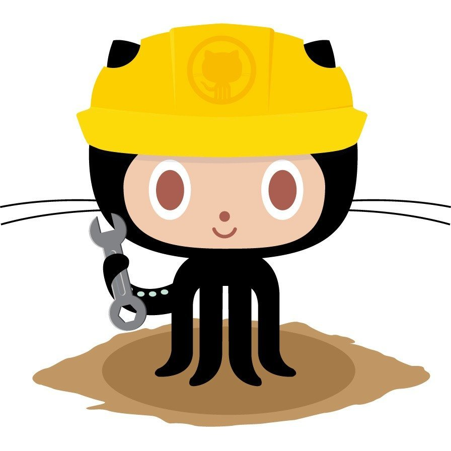

Para poder observar los partidos de la Champions, algún partido de las princioales ligas de Europa o América, ver un documental o algun canal por cable, solo necesitas instalar el APK de Kraken TV y tener una velocidad de Internet como minimo 6mb para sintonizar la señal sin problemas.

Los Pasos son los Siguientes:

1. Descargar la App de su página oficial: <a href="https://github.com/krakentv2/release/raw/master/app148.apk" target="_blank">Kraken Tv</a>

2. Activar la opción de Origenes Desconocidos en tu Smarphone para poder instalar Apps que no son procedentes de la Google Play.

3.Instalar la App y Disfrutar